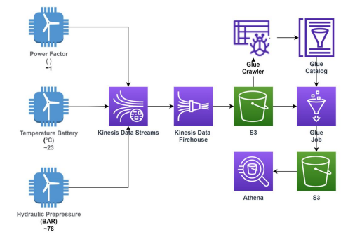

## Projeto: Aquisição e Disponibilização de Dados em Streaming de Sensores de Turbina Eólica (fictícios) em Ambiente AWS

## Objetivo:
O objetivo deste projeto é simular a aquisição de dados em tempo real (Streaming) de sensores instalados em uma turbina eólica, armazenar e analisar esses dados no ambiente da AWS (Amazon Web Services)

## Criação dos Produtores de Informação:
Foram criados produtores de informação simulando os sensores de aquisição de dados, sendo eles:

"Power Factor" (entre 0.7 e 1)

"Battery Temperature" (entre 20 e 25 graus Celsius)

"Hydraulic Pressure" (entre 70 e 80 BAR)

## Configuração do Ambiente AWS Kinesis:
O ambiente AWS Kinesis foi configurado para receber os dados gerados pelo Kinesis Data Stream. Esses dados são entregues ao bucket criado no AWS S3 através do serviço Kinesis Data Firehose.

## Utilização do AWS Glue:

O AWS Glue Catalog foi utilizado para gerar um banco de dados.
O Glue Crawler foi empregado para criar uma tabela a partir dos dados armazenados no AWS S3.
Um Glue Job foi implementado para descobrir os dados adquiridos e consolidá-los em um datalake no AWS S3, tornando-os disponíveis para consulta.

## Disponibilização para Consulta no AWS Athena:
Os dados consolidados no datalake criado são acessíveis para consulta através do serviço AWS Athena, que possibilita a realização de análises e interpretação dos dados.

Com esse projeto, é possível simular o fluxo de aquisição, armazenamento e análise de dados de sensores em tempo real, demonstrando o uso de diversos serviços da AWS, como AWS Kinesis, AWS S3, AWS Glue e AWS Athena para a criação de um ambiente completo de processamento de streaming de dados. O projeto foi desenvolvido no contexto do curso de Formação em Engenharia de Dados em 2022.